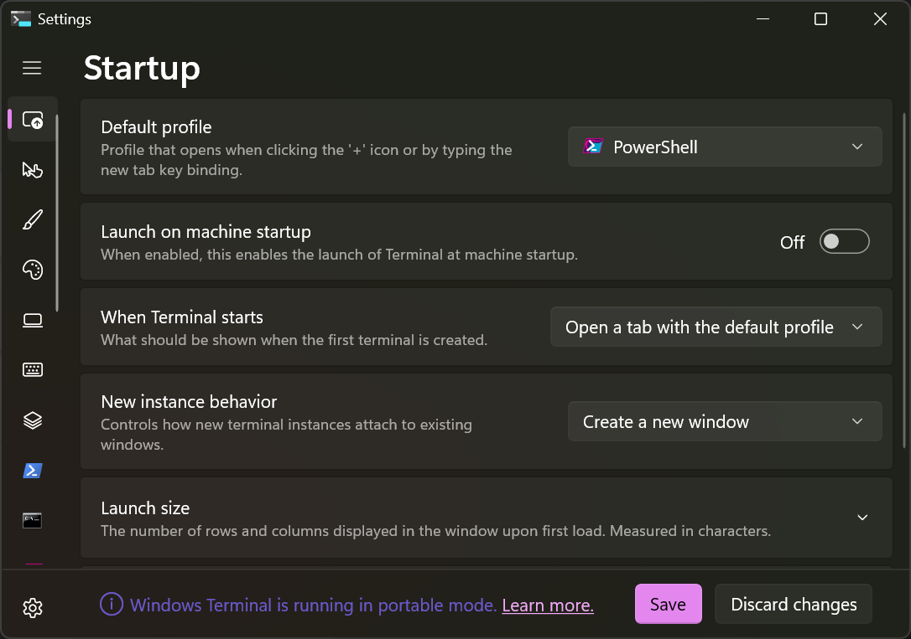

# Windows Terminal Portable
Windows Terminal supports [Portable mode](https://en.wikipedia.org/wiki/Portable_application). Portable mode enables all data created and maintained by Windows Terminal to live near itself so that it can be moved across different environments. 

Portable mode is supported on the [unpackaged ZIP download](https://github.com/microsoft/terminal/releases). This release is an official unpackaged execution where Windows Terminal stores its settings in a `settings` folder next to `WindowsTerminal.exe`. Portable mode is not available on the packaged execution of Windows Terminal.

## Why use Portable mode? 
Windows Terminal portable mode empowers users with the ability to use Windows Terminal without the need to install it like a traditional application. 
This is especially useful for users who unable to download and install Windows Terminal from the Microsoft Store. 

Portable mode allows developers to archive preconfigured versions of their Windows Terminal. Users can then carry their preconfigured version of Windows Terminal on a portable device (such as a USB flash drive) or a cloud drive and then use it on another Windows machine. 

Portable applications have historically allowed distributors to ship a self-contained and preconfigured version of their installation. This means that users can also test multiple versions of Windows Terminal via Portable mode without fearing global settings pollution. 

## Enabling Portable mode
Portable mode needs to be enabled manually. After unzipping the Windows Terminal download, create a `.portable` file next to `Microsoft.Terminal.Settings.Model.dll`. 
The presence of the `.portable` file will change the settings and state paths to be rooted to the `settings` subfolder next to `Microsoft.Terminal.Settings.Model.dll`.
If this `.portable` file is present, then `WindowsTerminal.exe` will launch in Portable mode.

## Disabling Portable mode
You can migrate from Portable mode to the original "Unpackaged mode" where Windows Terminal saves its global settings in the `user` folder.
To do this, delete the `.portable` file next to `Microsoft.Terminal.Settings.Model.dll`.

If there is no `.portable` file then Windows Terminal will default to reading your global settings and saving them in the `user` folder.
If you wish to reenable portable mode, then you can create a new `.portable` file next to `Microsoft.Terminal.Settings.Model.dll`.
